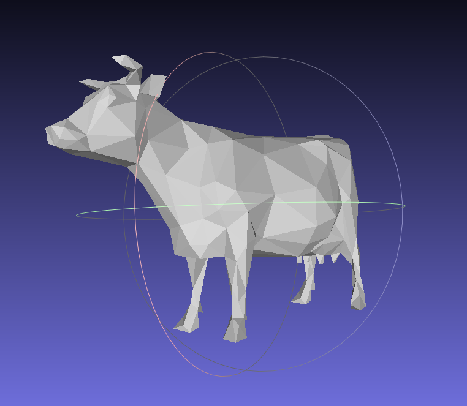

## Mesh Processing
This project implements various operations on meshes. It was completed for CS2240: Advanced Computer Graphics, at Brown University

### Features
- Half-edge mesh representation
- Loop subdivision
- [Quadric error simplification](https://www.cs.cmu.edu/~garland/Papers/quadrics.pdf)
- [Isotropic remeshing](https://www.graphics.rwth-aachen.de/media/papers/remeshing1.pdf) (this implementation may be bugged)

A cow mesh before and after simplification:

### Building and running the project
Make sure to run "git submodule update --init" after cloning. The project can be built in Qt Creator. Open the project via the CMakeList and set the working directory to the base directory of the project. Pass the path to the config file as a command line argument. See example config files in "template_inis/".
