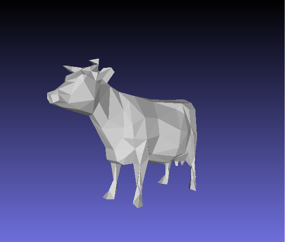

## Mesh (final submission)

Please fill this out and submit your work to Gradescope by the deadline.

### Output Comparison

Run the program with the specified `.ini` config file to compare your output against the reference images. The program should automatically save the output mesh to the `student_outputs/final` folder. Please take a screenshot of the output mesh and place the image in the table below. Do so by placing the screenshot `.png` in the `student_outputs/final` folder and inserting the path in the table.

- For instance, after running the program with the `subdivide_icosahedron_4.ini` config file, go to and open `student_outputs/final/subdivide_icosahedron_4.obj`. Take a screenshot of the mesh and place the screenshot in the first row of the first table in the column titled `Your Output`.
- The markdown for the row should look something like `| subdivide_icosahedron_4.ini |   |  |`

If you are not using the Qt framework, you may also produce your outputs otherwise so long as the output images show up in the table. In this case, please also describe how your code can be run to reproduce your outputs.

> Qt Creator users: If your program can't find certain files or you aren't seeing your output images appear, make sure to: 
>
> 1. Set your working directory to the project directory
> 2. Set the command-line argument in Qt Creator to `template_inis/final/<ini_file_name>.ini`

Note that your outputs do **not** need to exactly match the reference outputs. There are several factors that may result in minor differences, especially for certain methods like simplification where equal-cost edges may be handled differently.

Please do not attempt to duplicate the given reference images; we have tools to detect this.

| `.ini` File To Produce Output |                     Expected Output                      |                                   Your Output                                   |
| :---------------------------: | :------------------------------------------------------: | :-----------------------------------------------------------------------------: |
|  subdivide_icosahedron_4.ini  |  |  |
|   simplify_sphere_full.ini    |     |     |
|       simplify_cow.ini        |             |             |

Output for Isotropic Remeshing (Note: if you did not implement this you can just skip this part)
| `.ini` File To Produce Output | Input Mesh .png | Remeshed Mesh .png |
| :---------------------------------------: | :--------------------------------------------------: | :-------------------------------------------------: |
| <Path to your .ini file> |  |  |

Output for Bilateral Mesh Denoising (Note: if you did not implement this you can just skip this part)
| `.ini` File To Produce Output | Noisy Mesh .png | Denoised Mesh .png |
| :---------------------------------------: | :--------------------------------------------------: | :-------------------------------------------------: |
| <Path to your .ini file> |  |  |

Output for any other Geometry Processing Functions (Note: if you did not implement this you can just skip this part)
| `.ini` File To Produce Output | Input | Output |
| :---------------------------------------: | :--------------------------------------------------: | :-------------------------------------------------: |
| <Path to your .ini file> |  |  |

### Implementation Locations

Please list the lines where the implementations of these features start:

- [Mesh data structure](https://github.com/brown-cs-224/mesh-wiedmann-trey/blob/f082cc77bf22cef2d2dcdd3c63c72a0fc173c7d8/mesh.h#L52)
- [Mesh validator](https://github.com/brown-cs-224/mesh-wiedmann-trey/blob/f082cc77bf22cef2d2dcdd3c63c72a0fc173c7d8/mesh.cpp#L208)
- [Loop Subdivision](https://github.com/brown-cs-224/mesh-wiedmann-trey/blob/f082cc77bf22cef2d2dcdd3c63c72a0fc173c7d8/loop_subdivision.cpp#L11)
- [Quadric Error Simplification](https://github.com/brown-cs-224/mesh-wiedmann-trey/blob/f082cc77bf22cef2d2dcdd3c63c72a0fc173c7d8/quadric_error_simplification.cpp#L94)
- [Remeshing](https://github.com/brown-cs-224/mesh-wiedmann-trey/blob/f082cc77bf22cef2d2dcdd3c63c72a0fc173c7d8/remeshing.cpp#L54)

### Design Choices

Each feature is in their own cpp file, I broke out the atomic operations into a separate file.

#### Mesh Data Structure

I have a standard halfedge implementation. The mesh has a std::unordered map of halfedges. Each halfedge has a next, twin, face, vertex, and edge. Vertices, faces, and edges point to a corresponding halfedge.

#### Mesh Validator

- Tests 0-4 : half edges have all fields (not null ptr)
- Test 5 : each half edge has two edges
- Test 6 : we can follow halfedges in a loop around a face back to the original one
- Test 7 : halfedges are twins of each other
- Test 8 : follow the halfedges around a vertex, they should share that vertex
- Test 9 : we have a disc around a vertex
- Test 10 : halfedges of same face share that face

#### Run Time/Efficency
For atomic operations, halfedges let us perform them in constant time relatively easily.

For loop subdivision, I use unordered maps to associate the positions of surrounding vertices with each edge and vertex, so I can access these properties in constant time after splitting and flipping to update postions. Thus, each iteration of loop subdivision should run in linear time.

For quadric error simplification, I mantain a priority queue that is actually a multimap from floats to pairs of edges and 3d points. The float is the error for collapsing, the edge is the edge that would be collapsed, and the point is the point to collapse that edge to. Because we can remove from the multimap in log time, the overall algorithm should run in nlogn time. 

### Collaboration/References
Worked alone.

### Known Bugs
I implemented remeshing, but having trouble with the collapsing edges step, so I commented that out. The remeshing thus ends up with a lot more faces than before.
